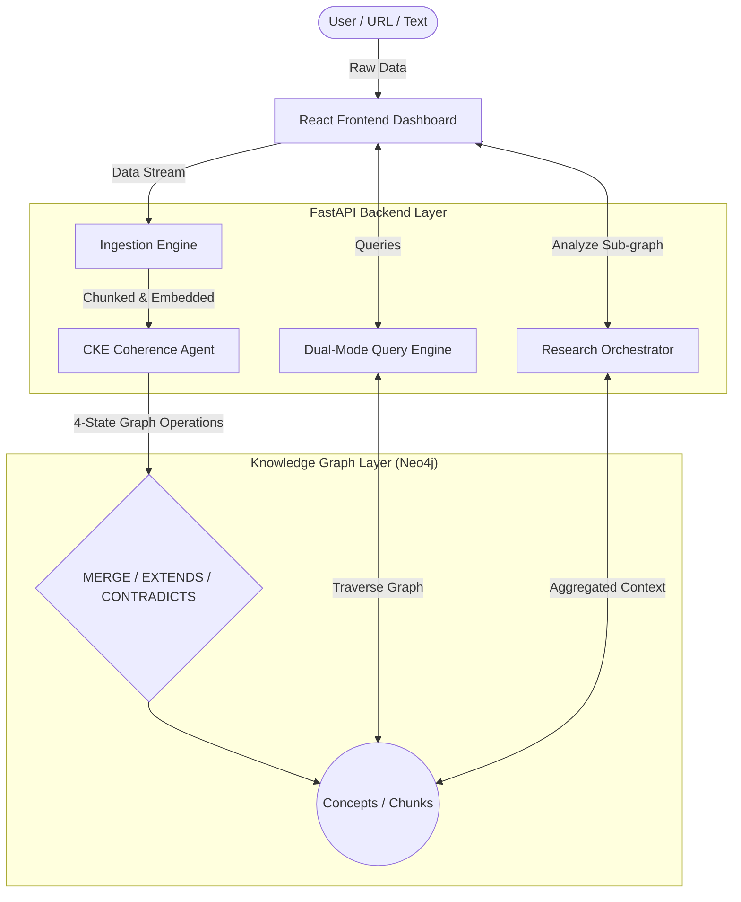
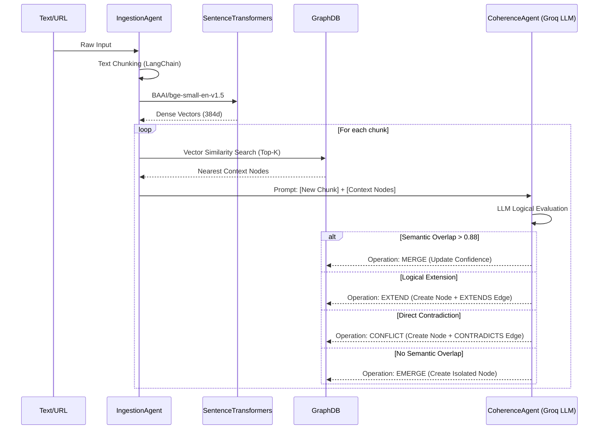

<div align="center">
  <h1>MNEMO</h1>
  <p><b>Continuous Knowledge Engineering via LLM-Graph Orchestration</b></p>
</div>

---

## 📖 Abstract & Overview
Traditional Retrieval-Augmented Generation (RAG) models suffer from a fatal flaw: they act as passive, static memory banks. When a standard RAG system ingests new documents, it blindly appends them to a vector database without evaluating semantic overlap, factual contradictions, or logical extensions of existing knowledge. This results in bloated, noisy context windows and "hallucination by contradiction."

**MNEMO** is a research-grade platform that solves this through **Continuous Knowledge Engineering (CKE)**. By orchestrating Large Language Models (LLMs) with a native Graph Database (Neo4j), MNEMO doesn't just retrieve knowledge—it actively evaluates, structures, and synthesizes incoming information into a living, interconnected cognitive graph.

## 🚀 Novelty & Contribution
MNEMO introduces several novel architectural paradigms that move beyond the limitations of standard semantic search:

1. **The 4-State CKE Matrix**: Instead of simple insertion, every incoming chunk of knowledge is evaluated by an LLM-driven Coherence Agent. The agent computes similarity and applies logical reasoning to categorize the ingestion into one of four states: **MERGE**, **EXTEND**, **CONFLICT**, or **EMERGE**.
2. **Socratic Graph Synthesis**: Rather than simply answering user questions factually, the Query Engine can operate in "Socratic Mode." By traversing `CONTRADICTS` edges in the graph, the LLM actively highlights tensions in the literature and challenges the user's implicit assumptions.
3. **Autonomous Research Orchestrator**: A specialized multi-agent system that analyzes sub-graphs to dynamically identify literature trends, missing gaps, structural contradictions, and novel hypotheses.

---

## 🏗️ High-Level Architecture

The system operates across three primary stages: **Ingestion**, **Storage**, and **Retrieval/Orchestration**.



---

## ⚙️ Low-Level Component Design

At the implementation level, MNEMO relies on dense vector retrieval combined with LLM-based logical gating.



---

## 🧠 Core CKE Semantics

The core of MNEMO's intelligence lies in the deterministic mapping of LLM reasoning to Graph Operations.

1. **MERGE (`a = b`)**: The incoming knowledge is semantically identical to a node already in the database. Instead of duplicating data, the system reinforces the original node by incrementing its `confidence` score.
2. **EXTEND (`a ⊃ b`)**: The incoming knowledge adds detail, nuance, or sub-topics to an existing concept. A new node is created and linked via an `[EXTENDS]` relationship, building a hierarchical taxonomy.
3. **CONFLICT (`a ≠ b`)**: The incoming knowledge directly contradicts a fact or theory in the database. A new node is created and linked via a `[CONTRADICTS]` relationship. This is critical for scientific discovery and maintaining a balanced knowledge base without destructive overwrites.
4. **EMERGE (`a ∩ b = ∅`)**: The incoming knowledge is statistically distant and logically unrelated to existing concepts. It is instantiated as a new root node, serving as an anchor for future knowledge.

---

## 🔬 Multi-Agent Research Orchestrator

MNEMO ships with a multi-agent orchestration pipeline designed for deep literature review and hypothesis generation. Given a sub-graph of nodes, the orchestrator triggers four concurrent LLM sub-agents:

- **Literature Agent**: Identifies statistical trends, recurring concepts, and unaddressed gaps in the text.
- **Hypothesis Agent**: Synthesizes distant nodes to propose novel, testable hypotheses.
- **Contradiction Agent**: Highlights structural tensions and logical fallacies between disparate nodes.
- **Novelty Agent**: Flags highly anomalous or paradigm-shifting information against the established graph baseline.

---

## 🛠️ Technology Stack

| Domain | Technology | Rationale |
| :--- | :--- | :--- |
| **LLM Engine** | `Groq API` (Llama 3.1 8B) | Ultra-low latency inference required for real-time CKE evaluation pipeline. |
| **Embeddings** | `SentenceTransformers` | Local execution of `BAAI/bge-small-en-v1.5` for fast 384-dimensional dense vectors. |
| **Database** | `Neo4j` | Native property graph for storing both high-dimensional vectors and explicit semantic edges. |
| **Backend** | `FastAPI` (Python) | High-throughput asynchronous orchestration and routing. |
| **Frontend** | `React` + `Vite` | Dynamic, responsive glassmorphic UI with real-time CKE operation feeds. |

---

## 📦 Local Installation & Setup

### Prerequisites
- Python 3.10+
- Node.js (v18+)
- Docker (For the Neo4j instance)
- A Groq API Key

### 1. Database Initialization
Spin up the Neo4j container:
```bash
docker-compose up -d
```

### 2. Backend Orchestration Server
Install the required Python packages:
```bash
pip install -r requirements.txt
```
Create a `.env` file in the root directory:
```env
GROQ_API_KEY=your_groq_api_key_here
GROQ_MODEL=llama-3.1-8b-instant
NEO4J_URI=bolt://localhost:7687
NEO4J_USER=neo4j
NEO4J_PASSWORD=password
```
Boot the FastAPI server:
```bash
uvicorn app.main:app --reload --port 8000
```

### 3. Frontend Client
Navigate to the frontend directory:
```bash
cd frontend
npm install
npm run dev
```

The application will be accessible at `http://localhost:5174` (or `5173`).

---
*Developed as a research initiative bridging the gap between passive Vector Search and active Semantic Knowledge Engineering.*
